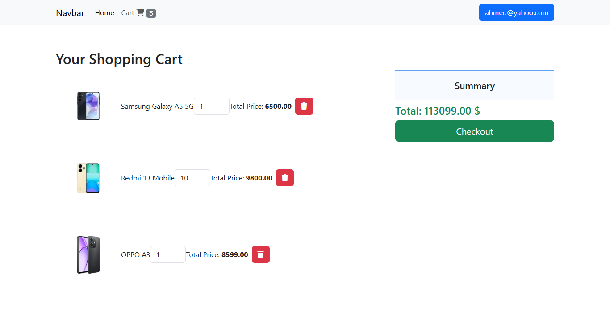

# Shopping Card Application

This is a simple shopping cart application built using **HTML**, **CSS**, and **JavaScript**. The application allows users to add, remove, and view items in their shopping cart, simulating the behavior of an online store's cart functionality.

## Features

- Add items to the shopping cart.
- View items in the cart.
- Remove items from the cart.
- View the total price of the cart.
## ScreenShot





## Installation

To run this project locally, follow these steps:

1. **Clone the repository:**
   ```bash
   git clone https://github.com/mohammadhussainshams7/mohammadhussainshams7-shopping-card.git
cd mohammadhussainshams7-shopping-card
### Instructions:
1. **Clone the repository** to your local machine.
2. **Open the `README.md` file**, paste the contents above, and adjust any parts like **Screenshots** if you have one.
